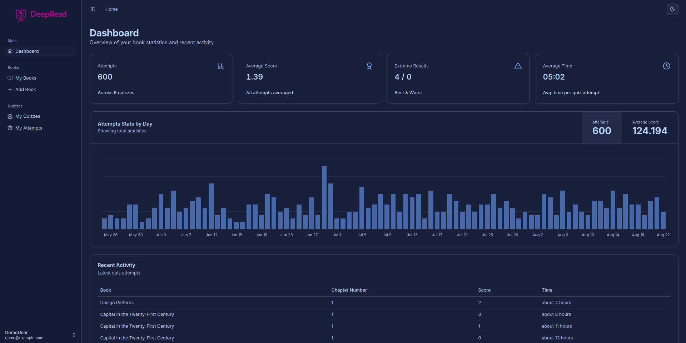
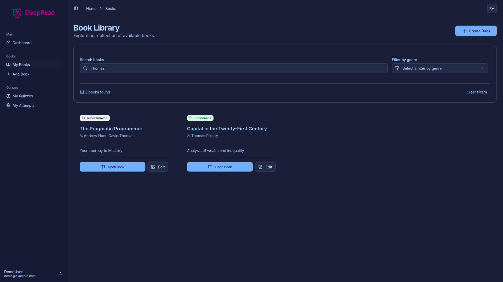

# DeepRead 

This project was born from one of my hobbies: **reading**.  I realized that I learned much better when I **summarized the books** I read, and even more when I later **tested my knowledge** with questions about them.  

That’s how **DeepRead** came to life — a tool designed to make learning active, tracking progress through dashboards.


---

## Technologies Used

- Java Spring Boot for backend development: JPA.
- Postgresql: for relational database.
- ReactJS + TailwindCSS: User interface for chapter edition, book pagination and dashboard visualization.
- Docker: Containers for the application and the database.
- 
- 

---

## Requirements

Before getting started, make sure you have installed:

- [Docker](https://www.docker.com/get-started) >= 20.x
- [Docker Compose](https://docs.docker.com/compose/install/) >= 2.x

You don’t need to install Java, Node, or databases locally — everything runs inside containers.

---

## Run the Project with Docker

1. Clone this repository:
   ```bash
    git clone https://github.com/gonblas/deepread.git
    cd deepread
    ```
2. Build and start the containers:
    ```bash
    docker compose up --build
    ```
3. The backend and frontend will be running automatically.
   - The web interface is available at: http://localhost:3000
   - The backend exposes the API documentation via Swagger: http://localhost:8080/swagger-ui.html
4. You can log in with the demo user:
    
    **Email:** demo@example.com

    **Password:** password


___

## Screenshots

### 🏠 Home Page - General Dashboard



---

### 📚 Books Page - Search as You Type



___

## Contributing

If you wish to contribute to the project, please open an issue or submit a pull request in the repository.

___

## License

This project is under the GNU GPLv3 license. For more information, see the LICENSE file.